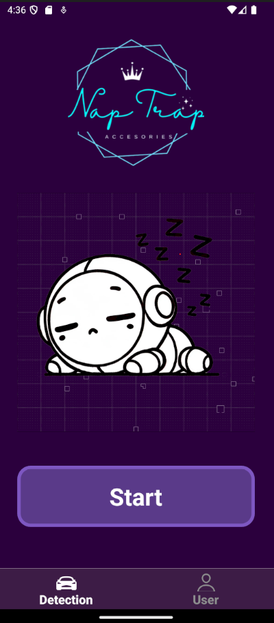
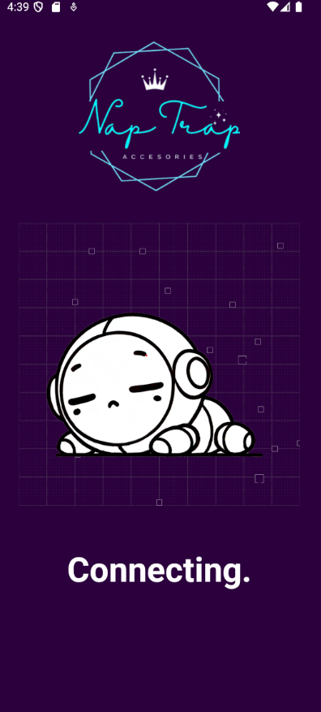
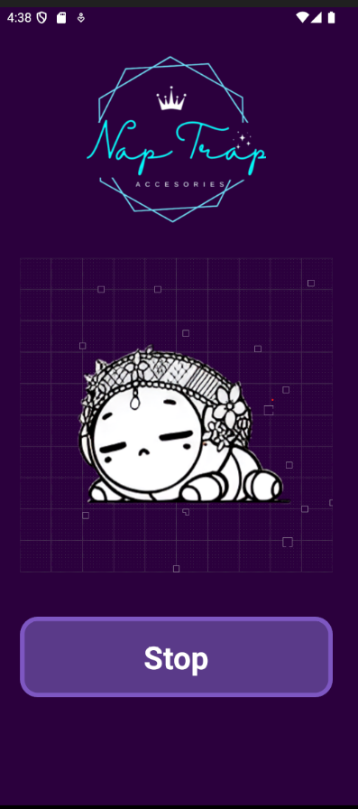
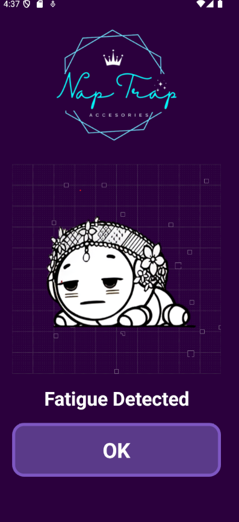
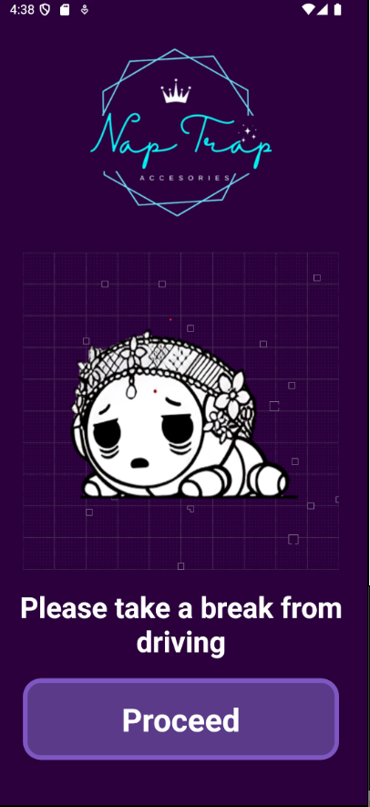

# Nap Trap Project - Driver Drowsiness Detection System 

## Introduction

&nbsp;&nbsp;&nbsp;&nbsp;This is the front-end of the mobile application for the Nap Trap Project (Driver Drowsiness Detection System). I used React Native to build front-end of the mobile application, and utilized Expo, which provided a set of pre-configured libraries and components that allowed for rapid prototyping and efficient deployment of the app.

&nbsp;&nbsp;&nbsp;&nbsp;The Nap Trap Project purpose is to create a product that help prevent driver from getting into an accident due to his/her drowsiness. The device will be attached to the user, and if the device detect drowsiness. The mobile application will warn the user about his/her condition, and will warn the user if the device detect drowsiness for multiple times.

## Application's Page

### Home Page

&nbsp;&nbsp;&nbsp;&nbsp;This is the home page of the application. Allowing the users click the button to detect their drowsiness.

### Connecting Page

&nbsp;&nbsp;&nbsp;&nbsp;This page that should display when the application is trying to connecting with the hardware (drowsiness detector).

### Detecting Page

&nbsp;&nbsp;&nbsp;&nbsp;This page which will display when the connection between the hardware and the app has already been established, and the app is waiting the hardware to send a signal that it detect drowsiness from the user.

### Drowsiness Detected Page

&nbsp;&nbsp;&nbsp;&nbsp;This page which will display when the drowsiness detected and warn the user about his/her condition.

### Warning to Take a Break Page

&nbsp;&nbsp;&nbsp;&nbsp;This page which will display when the drowsiness has been detected for a several time, and warned the user to stop driving

